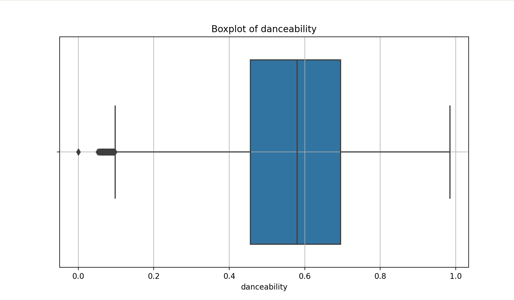
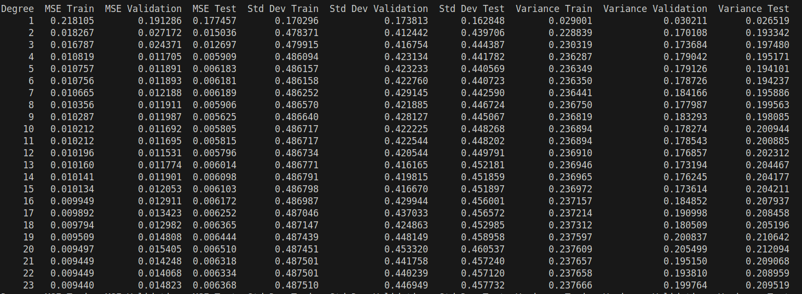

# MANAN CHICHRA (2022102058) - A1

# KNN

## EDA 
### Histograms
Histograms are graphical representations of the distribution of numerical data. They group data into bins (intervals) and plot the frequency (or count) of data points within each bin.

#### Interpretation
- **Normal Distribution**: A bell-shaped curve indicates a normal distribution, where most data points are around the mean.
- **Skewness**:

>  - ***Right Skew (Positive Skew)***: The tail on the right side is longer. Most data points are concentrated on the left. It suggests the presence of outliers or a long tail in the higher values.
>  - ***Left Skew (Negative Skew)***: The tail on the left side is longer. Most data points are concentrated on the right. It indicates a long tail in the lower values.
- **Uniform Distribution**: The data is evenly distributed across all bins.
- **Bimodal or Multimodal Distribution**: Two or more peaks in the histogram indicate the presence of subgroups within the data.

### Distribution
- ###### Multimodal & Right-Skewed

- ###### Normal

- ###### Left-Skewed

- ###### Multimodal

- ###### Normal

- ###### Unimodal

- ###### Right-Skewed

- ###### Unimodal

- ###### Right-Skewed

- ###### Normal

### Outliers

     

### Hierarchy of feature importance 

|Rank   |Feature         | Correlation Coefficient(Absolute)  |
|-------|----------------|--------------------------|     
|1.     |speechiness     |    0.085145              |
|2.     |acousticness    |   0.077217               |
|3.     |instrumentalness|    0.070664              |
|4.     |energy          |    0.056175              |
|5.     |explicit        |    0.054828              |
|6.     |valence         |    0.053307              |
|7.     |liveness        |    0.033565              |
|8.     |duration_ms     |    0.032826              |
|9.     |popularity      |    0.032692              |
|10.    |loudness        |    0.027233              |
|11.    |tempo           |    0.025926              |
|12.    |key             |    0.005508              |
|13.    |danceability    |    0.003569              |

### Various Column Combination

 

### Correlation Matrix

    Energy, Loudness & Acousticness show High Correlation

## Hyperparameter Tuning

### Top 10 pairs by validation accuracy:
|Rank   |K, distance_metric         | Accuracy  |
|-------|----------------|--------------------------|   
|Rank 1: |k=19, distance_metric=manhattan,| 0.2436|
|Rank 2: |k=17, distance_metric=manhattan,| 0.2404|
|Rank 3: |k=15, distance_metric=manhattan,| 0.2401|
|Rank 4: |k=13, distance_metric=manhattan,| 0.2362|
|Rank 5: |k=9, distance_metric=manhattan, | 0.2321|
|Rank 6: |k=11, distance_metric=manhattan,| 0.2320|
|Rank 7: |k=7, distance_metric=manhattan, | 0.2251|
|Rank 8: |k=1, distance_metric=manhattan, | 0.2155|
|Rank 9: |k=5, distance_metric=manhattan, | 0.2139|
|Rank 10:|k=5, distance_metric=euclidean, | 0.1996|

    Best Pair: k=19, distance_metric=manhattan
    Initial Pair: k=3, distance_metric=euclidean

### Plots

    A smaller k makes the model more sensitive to noise but might overfit, while a larger k provides a smoother prediction but might lose detail.

### Accuracy on Dropping Columns
**Loudness**:

|Rank   |K, distance_metric         | Accuracy  |
|-------|----------------|--------------------------|   
|Rank 1: |k=19, distance_metric=manhattan,| 0.2436|
|Rank 2: |k=17, distance_metric=manhattan,| 0.2404|
|Rank 3: |k=15, distance_metric=manhattan,| 0.2401|
|Rank 4: |k=13, distance_metric=manhattan,| 0.2362|
|Rank 5: |k=9, distance_metric=manhattan, | 0.2321|
|Rank 6: |k=11, distance_metric=manhattan,| 0.2320|
|Rank 7: |k=7, distance_metric=manhattan, | 0.2251|
|Rank 8: |k=1, distance_metric=manhattan, | 0.2155|
|Rank 9: |k=5, distance_metric=manhattan, | 0.2139|
|Rank 10:|k=5, distance_metric=euclidean, | 0.1996|

  

**Energy**:
|Rank   |K, distance_metric         | Accuracy  |
|-------|----------------|--------------------------|   
|Rank 1: |k=19, distance_metric=manhattan,| 0.2390|
|Rank 2: |k=17, distance_metric=manhattan,| 0.2389|
|Rank 3: |k=15, distance_metric=manhattan,| 0.2371|
|Rank 4: |k=13, distance_metric=manhattan,| 0.2346|
|Rank 5: |k=9, distance_metric=manhattan, | 0.2329|
|Rank 6: |k=11, distance_metric=manhattan,| 0.2275|
|Rank 7: |k=7, distance_metric=manhattan, | 0.2221|
|Rank 8: |k=1, distance_metric=manhattan, | 0.2202|
|Rank 9: |k=5, distance_metric=manhattan, | 0.2176|
|Rank 10:|k=5, distance_metric=euclidean, | 0.2145|

- **We observe _higher_ accuracy when we drop column - 'loudness' & _lower_ accuracy when we drop column 'energy'.**

- **This is confirmed with the fact that Energy is ranked higher than loudness in the column Hierarchy**
    
    [check above](#Hierarchy)

### Optimisation

##### KNN Vectorization

In a vectorized K-Nearest Neighbors (KNN) implementation, the batch size determines how many test samples are compared against all training samples at once. Here's how it works:

- ***Batch Size of 1***: Each test sample is processed individually. The distances from this single test sample to all training samples are computed, neighbors are identified, and the prediction is made. This approach is memory-efficient but can be slow for large datasets.
- ***Larger Batch Sizes***: Multiple test samples are processed simultaneously. The distances between each of these test samples and all training samples are computed in parallel, reducing the overall computation time. However, this requires more memory, as the model must store and process the distance matrices for all test samples in the batch at once.

 
 
 
 
**Metrics for Spotify-2**

Validation Set
- Accuracy : 0.151990245614035
- Precision : 0.13996859140216398
- Recall : 0.1522632654844223

Test Set
- Accuracy : 0.15035087719298244
- Precision : 0.13723200483166526
- Recall: 0.15204789677254746

 
 

# Linear Regression

## Simple Regression

**Degree 1**:

With Different Learning Rates:

Learning rate influences how quickly the model converges. If the learning rate is too low, the model can take a long time to converge. However, if the learning rate is too high, the model never converges, but instead bounces around the weights and bias that minimize the loss. The goal is to pick a learning rate that's not too high nor too low so that the model converges quickly.

The learning rate determines the magnitude of the changes to make to the weights and bias during each step of the gradient descent process. The model multiplies the gradient by the learning rate to determine the model's parameters (weight and bias values) for the next iteration. In the third step of gradient descent, the "small amount" to move in the direction of negative slope refers to the learning rate.

**Degree > 1**

    K that minimizes the error on the test set is around 5 to 7

**Animation**:

***Random Seeds:***
- **Assess Stability**: By using different seeds, we can assess how stable model's performance is. If results are consistent across different seeds, it indicates that the model is robust and not overly sensitive to random variations in the data.
- **Evaluate Generalization**: Different seeds produce different splits of the data. Testing across multiple seeds helps evaluates how well the model generalizes to different subsets of data, providing a better estimate of its performance on unseen data.

 
 

 
 
Metrics

 
 
 
 

## Regularisation

    alpha -> regularisation parameter

**Visualisation**

**Without Applying Regularisation**

***Metrics***

    Variance starts to increase as we increase degree >= 16, indicating overfitting

**With Regularisation**

 
 

***Metrics***

***Observations using Regularization:***

1. **Overfitting and Underfitting**:
    - **Without Regularization**: We observe that the model fits the training data very well (low training error) but performs poorly on validation and test data (high validation and test error). This indicates overfitting.
    - **With Regularization**: Regularization helps in reducing overfitting. We notice a better balance between training and validation errors. The model has slightly higher training error but improved generalization to unseen data.
2. **Effect of Polynomial Degree**:
    - **Higher Degrees**: We see that Polynomial regression model with higher degrees is overfitting the training data. Regularization helps overcome this by smoothing the model and avoiding excessively complex fits.
    - **For lower-degree:**  the difference might be minimal, as the model complexity is already controlled.
3. **L1 & L2 Regularization**:
    - **L1 Regularization** : L1 regularization tends to produce models, where some coefficients are exactly zero. This can lead to feature selection, making it useful for models with many features.
    - **L2 Regularization** : L2 regularization generally shrinks the coefficients towards zero but does not set any of them exactly to zero. It helps in reducing the impact of less significant features without completely removing them.
4. **Alpha (Regularization Strength)**:
    - **Low Alpha**: With a low value of alpha, regularization has a small effect, and the model is closer to the unregularized version. Training errors are lower, but validation and test errors are slightly higher.

******************************************
    chatgpt usage-
    1. How to predict in batches in KnnVectorisation
    2. For Animation
    3. Plotting different types of graphs

