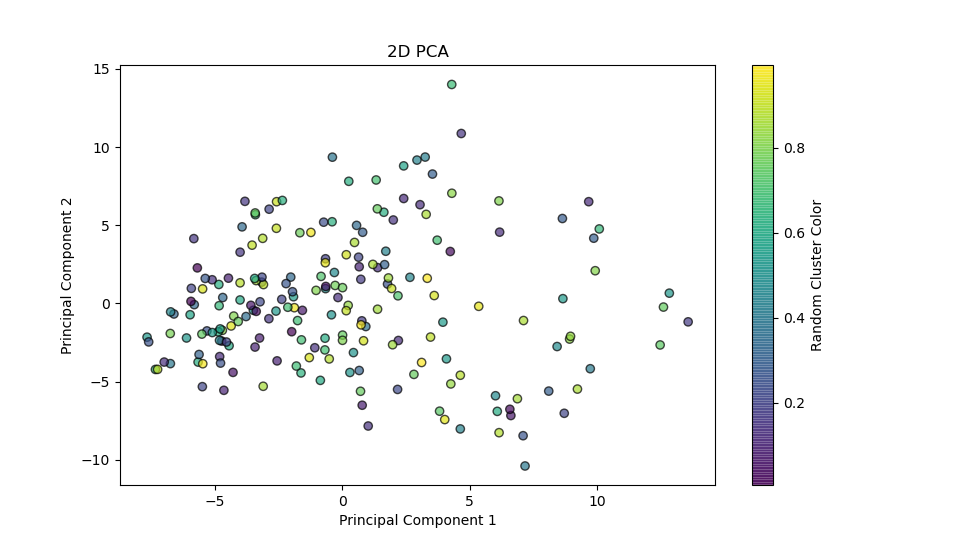

# MANAN CHICHRA (2022102058) - A2

## K-Means Clustering

K-Means is used to partition a dataset into k distinct groups (clusters) based on their features. The goal is to minimize the variance within each cluster while maximizing the variance between clusters. The algorithm operates iteratively to assign each data point to one of k clusters based on feature similarity.

**Working**

- **Initialise:** Select k random points as initial cluster centroids (means).
- **Assign:** Assign each data point to the nearest cluster centroid based on a distance metric (eg - Euclidean distance).
- **Update:** Compute the new centroids by averaging the data points assigned to each cluster.
- **Repeat:** Reassign data points to the new centroids and update the centroids again. Repeat until the centroids stop changing significantly.

**WCSS (Within-Cluster Sum of Squares)**
- WCSS is the sum of squared distances between each point in a cluster and the centroid of that cluster. It measures the compactness of the clusters, and a lower WCSS indicates tighter and more defined clusters.

Where:

- $k$ is the number of clusters.
- $Ci$ is the set of points in cluster i.
- $xj$ is a data point in cluster i.
- $ui$ is the centroid of cluster i.

**Elbow Method**
- The Elbow Method is used to determine the optimal number of clusters (k) in K-Means clustering. 
- It is based on plotting the Within-Cluster Sum of Squares (WCSS) against the number of clusters (k) and identifying the point where the rate of decrease slows down significantly, resembling an "elbow."

### Q3

    kmeans1 = 5

    WCSS with k=5 : 3915.4519432854922

## Gaussian Mixture Models

- GMM is a probabilistic model that assumes that data is generated from a mixture of several Gaussian distributions, each with its own mean and variance. It is used for clustering by modeling the underlying distribution of the data rather than simply grouping points based on their distance (like K-Means does).

**Key Concepts:**
- Gaussian Distribution (Normal Distribution): A Gaussian distribution is a bell-shaped curve characterized by two parameters:

>   -   Mean (μ): The center of the distribution.
>   - Variance (σ²): The spread of the distribution.

- **Soft Clustering:** Unlike K-Means, which assigns each data point to exactly one cluster, GMM provides a probabilistic assignment. Each data point belongs to all clusters to some degree, but with different probabilities.

- **Cluster Shape:** K-Means assumes that clusters are spherical and evenly sized (due to Euclidean distance), but GMM is much more flexible because it can model clusters with different shapes, sizes, and orientations, thanks to the covariance matrix that controls the shape of the Gaussians.

**Q4.2**

    GMM Class Log-Likelihood: 516305.3086511503
    Sklearn GMM Log-Likelihood: 558079.7390737967

**log-likelihood** is a measure of how well the model fits the observed data. It represents the probability (in logarithmic form) of the observed data given the current parameters of the model (means, covariances, and weights of the Gaussian components).

- **Higher log-likelihood** values indicate that the model fits the data better. It suggests that the parameters chosen by the model make the observed data more probable.
- **Lower log-likelihood** values mean the model is less likely to explain the data well with its current parameters.

**log-likelihood** is also used for comparing models. If two models have different log-likelihoods, the one with the higher log-likelihood fits the data better

- Our GMM model & the SKLEARN model have similar log-likelihood values.

- Sklearn GMM benefits from optimized algorithms, support for various covariance structures, efficient matrix decomposition techniques, and adaptive regularization. These make it robust, leading to better log-likelihood scores and stability in model training.

### AIC & BIC

$AIC$ $=$ $2k$ $−$ $2ln(L)$

k is the number of parameters in the model.
L is the maximum likelihood of the model (how well the model fits the data).

**Interpretation:**

Lower AIC is better.
AIC balances between goodness of fit and model complexity by penalizing more complex models (i.e., those with more parameters).
The idea is that a more complex model can fit the data better, but it might also overfit, meaning it adapts too much to noise or random variations in the data.

- When comparing models, the one with the lowest AIC is generally preferred because it indicates a better trade-off between fitting the data and avoiding overfitting.

$BIC$ $=$ $kln(n)$ $−$ $2ln(L)$

n is the number of data points.

**Interpretation:**

Lower BIC is better.
BIC penalizes more complex models (i.e., those with more parameters) more heavily than AIC does, especially as the number of data points grows.
Since BIC includes the sample size in its penalty term, it prefers simpler models as the dataset gets larger.

- The model with the lowest BIC is considered to be the best fit, with a stronger preference for simplicity.

    kgmm1 = 2

## PCA
    Mean Square Erro 2D: 0.0395
    Check PCA for 2D:  True
    Mean Square Error 3D: 0.0375
    Check PCA for 3D:  True

**Understanding the Axes from PCA**

Principal Component 1 (PC1): This axis captures the direction of the greatest variance in the data. The data points have the most spread along this axis, meaning it explains the largest proportion of the total variance.

Principal Component 2 (PC2): This axis captures the second greatest variance in the data. It is orthogonal (perpendicular) to PC1 and explains the next highest amount of variance after PC1.

Higher Principal Components: Each subsequent component captures decreasing amounts of variance and is also orthogonal to the previous components. These components together represent the directions in which the data spreads out the most in high-dimensional space.

The new axes (principal components) represent linear combinations of the original features. This means each new axis is a weighted sum of the original variables, with the weights determined in such a way that the variance of the data along each axis is maximized.

- Looking at the plots k = 3,4 seems sufficient 

## PCA + Clustering

### Q6

    k2 = 3
    (estimated from the 2D visualization of the dataset)

**Scree plot to identify the optimal number of dimensions for
reduction**

    Optimal Dimensions = 5

**Optimal number of clusters for the reduced dataset using Elbow Method -**

    kkmeans3  = 6 (where slope of the curve becomes low - flat-like slope)

### Q6.3

### Q6.4

    kgmm3 (BIC) = 2
    kgmm3 (AIC) = 7

> kgmm3(AIC)

### 7. Cluster Analysis

#### K-means
- kkmeans1 = 5
- k2 = 3
- kkmeans3 = 6

    kkmeans1 = 5, Average Coherence: 0.6971
    Cluster Coherence Scores: [0.36623951863973103, 0.781201530618967, 0.7707669176998622, 0.7190949666033527, 0.8482197722353483]

    kkmeans3 = 6, Average Coherence: 0.7044
    Cluster Coherence Scores: [0.36623951863973103, 0.7795749464931229, 0.7780259114201031, 0.7113253522213414, 0.8492790215287056, 0.7417528019375657]
    
    k2 = 3, Average Coherence: 0.7418
    Cluster Coherence Scores: [0.6190944738924752, 0.8414745048374754, 0.7646966231656812]

**Lower Coherence Score:**

- Indicates better cluster cohesion. It means that the average distance between points in the cluster and the cluster's centroid is smaller. Essentially, the points within the cluster are closer to each other and to the centroid, suggesting that the cluster is more tightly packed and the members of the cluster are more similar to each other.

> Kkmeans3 is the most coherent

**Coherence** is calculated using a method based on cluster centroid distances and intra-cluster distances. The coherence for each cluster is determined by measuring how closely related or similar the data points within the same cluster are. The steps involved in calculating coherence are as follows:

1. **Compute Distance Matrix**:
Calculate the pairwise distances between data points within each cluster. This gives an idea of how similar or different the data points are within the same cluster.
2. **Calculate Intra-cluster Distances**:
For each cluster, compute the distances of all points from the cluster's centroid. This measures how tightly packed the points are around the centroid.
3. **Compute Coherence Score**:
Aggregate these distances to get a coherence score for each cluster. Higher coherence indicates that data points within the cluster are more similar to each other.

#### GMM
    kgmm1 = 2
    k2 = 3
    kgmm3 = 7

    {'n_components': 2, 'Coherence': 0.009542342268777152}
    {'n_components': 3, 'Coherence': 0.03906050679282758}
    {'n_components': 7, 'Coherence': 0.06409944867375399}
- Best model based on coherence: Kgmm3 =  7, Coherence: 0.06409944867375399

-   Calculates the average pairwise cosine similarity within each cluster to measure the coherence. It uses cosine similarity to quantify how closely related the words are within the same cluster. ***Higher coherence means that words in the same cluster are more similar.***
 
## Comparison btw GMM & K-Means

**Cluster Evaluation:**
- **Silhouette Score:** Measures how similar an object is to its own cluster (cohesion) compared to other clusters (separation). The higher the score, the better the clusters are.
- **Davies-Bouldin Index:** Measures the average "similarity" ratio of each cluster with respect to its most similar cluster. Lower values indicate better clustering

- K-means Silhouette Score: 0.020424038641310097
-    K-means Davies-Bouldin Index: 4.44043161916405
-   GMM Silhouette Score: 0.012099319086727732
-    GMM Davies-Bouldin Index: 4.251640133075007

## Hierarchical Clustering

**Comparison**
### Ward Linkage (Best out of the four)
**Advantages:**
- Balanced Clusters: Produces clusters that are more balanced in terms of size and density.
- Hierarchical Structure: Provides a detailed hierarchical structure of clusters, which is useful for understanding relationships at various levels.
- Variance Minimization: minimizes the variance within clusters, leading to more compact and cohesive groups.

### Complete Linkage
**Advantages:**
- Tight Grouping: Groups related items together effectively, ensuring that clusters are cohesive.
- Good Reach: Maintains a good reach or distance between clusters, making it easier to distinguish between them.

## Nearest Neighbor Search

**Without PCA**

    k=19, metric=manhattan
    Accuracy: 0.2427
    Micro_f1: 0.2427
    Macro_f1: 0.2364
    recall:   0.2427
    precision:0.2305

**With PCA**
<!-- - 6 dimensions: -->
    (Taking 6 Dimensions)
    k=19, metric=manhattan
    Accuracy: 0.1766
    Micro_f1: 0.1766
    Macro_f1: 0.1732
    recall:   0.1766
    precision:0.1700

    (Taking 8 Dimensions)
    k=19, metric=manhattan
    Accuracy: 0.1989
    Micro_f1:0.1989
    Macro_f1:0.1937
    recall:0.1989
    precision:0.1886

### Observations

- 6 dimensions

- 8 dimensions

- 6 seems to appropiate number of dimensions because inference time is also less and accuracy varies slightly as compared to higher dimensions

##### Computational Efficiency:

- **Full Dataset:** When we use the full Spotify dataset with all features (dimensions), the KNN algorithm has to compute distances in this high-dimensional space, which is ***computationally expensive***.
- **PCA-Reduced Dataset:** By reducing the number of dimensions (to 6 dimensions), the distance computations become cheaper and faster. KNN's complexity is directly related to the number of dimensions, so ***fewer dimensions result in lower computational cost.***

##### Dimensionality

- In high-dimensional spaces, distance calculations require evaluating more features, which increases the time and computational resources needed.
- By applying PCA, we retain the most important components (which capture the most variance in the data) and discard the rest, making KNN more efficient without significant loss in performance.

#### Loss of Information:
PCA reduces the number of features by projecting the data onto a lower-dimensional subspace. This can sometimes result in the loss of important information, which might be crucial for accurate classification or prediction.

**Taking 3 components**

    k=19, metric=manhattan
    Accuracy: 0.0939
    Micro_f1:0.0939
    Macro_f1:0.0906
    recall:0.0939
    precision:0.0874

- So we should not take very less components either. Although inference time reduces, accuracy becomes very low.

# Thank You

    ChatGpt
    plots
    gmm
    hierarchical clustering
