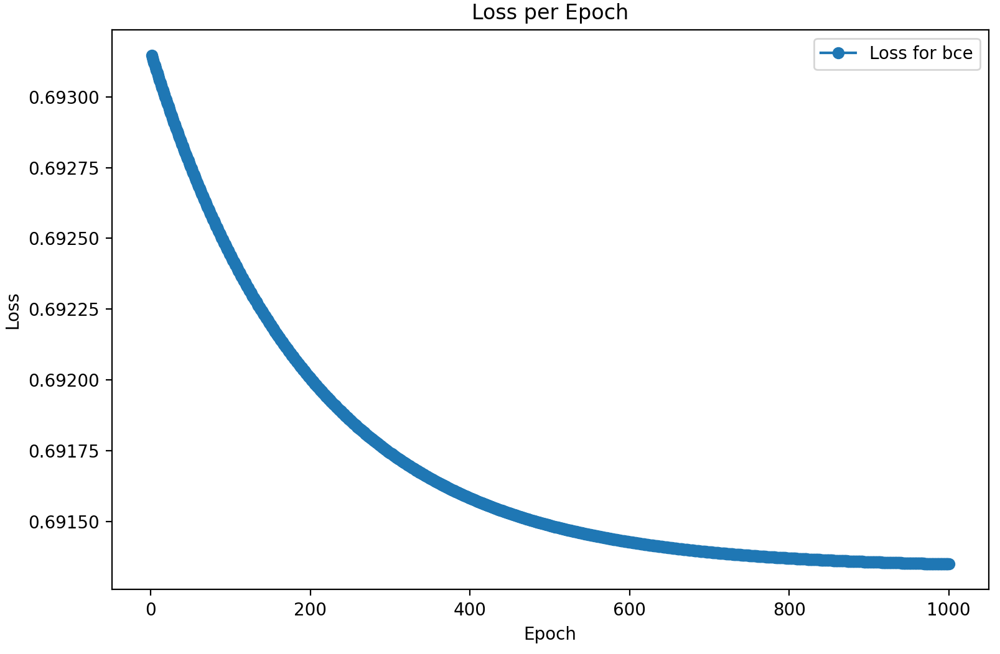

# MANAN CHICHRA (2022102058) - A3

## Wine-Quality Dataset

|                      | fixed acidity | volatile acidity | citric acid | residual sugar | chlorides |
|----------------------|---------------|------------------|-------------|----------------|-----------|
| **mean**             | 8.311111      | 0.531339         | 0.268364    | 2.532152       | 0.086933  |
| **std**              | 1.747595      | 0.179633         | 0.196686    | 1.355917       | 0.047267  |
| **min**              | 4.600000      | 0.120000         | 0.000000    | 0.900000       | 0.012000  |
| **max**              | 15.900000     | 1.580000         | 1.000000    | 15.500000      | 0.611000  |

|                      |  pH           | sulphates        | alcohol     | quality         |
|----------------------|---------      |-----------       |---------    |---------        |
| **mean**             | 3.311015      | 0.657708         | 10.442111   | 5.657043        |
| **std**              | 0.156664      | 0.170339         | 1.082196    | 0.805824        |
| **min**              | 2.740000      | 0.330000         | 8.400000    | 3.000000        |
| **max**              | 4.010000      | 2.000000         | 14.900000   | 8.000000        |

## Multi Layer Perceptron Classification

- **Implemented MLP classifier class as per the given specifications:**

### Model Training & Hyperparameter Tuning using W&B

- **Hyperparameter Tuning**

**Metrics**
(Across Various Runs)

- Accuracy

- Precision

- Recall

- F1-Score

-   **Best Set Of Hyperparameters:**

| activation | epochs | hidden_layer_1 | hidden_layer_2 | learning_rate |
|------------|--------|----------------|----------------|---------------|
| relu       | 1000   | 128            | 32             | 0.1           |

-   **Metrics**

| val_accuracy | val_f1  | val_precision | val_recall |
|--------------|---------|---------------|------------|
| 0.66812      | 0.41192 | 0.40469       | 0.42134    |

- **Test Metrics on Best Model**

| test_accuracy | test_f1  | test_precision | test_recall |
|--------------|---------|---------------|------------|
|  0.6607695652  | 0.3472766884531 | 0.3444318181818   |  0.345705683290|

### Analyzing Hyperparameters Effects

1. **Effect of Learning Rate**

- **Learning Rate = 0.1 (blue line)**: This line has a steep drop in loss in the early epochs, indicating very rapid learning. However, learning becomes erratic (as seen with the bumps around epoch 20), which suggests that such a high learning rate might overshoot the optimal values.
- **Learning Rate = 0.01 (orange line)**: This shows a smooth reduction in loss and stabilizes around 0.14 by the end, making it a good balance between speed and stability.
- **Learning Rate = 0.001 (green line)**: The loss decreases steadily, but at a slower rate than with 0.01. It takes more epochs to achieve similar results.
- **Learning Rate = 0.0001 (red line)**: This is the slowest in reducing loss. A very small learning rate leads to slow convergence, which results in underfitting.

2. **Effect of Non-linearity**

- Sigmoid performs well early on but may suffer from the vanishing gradient problem as it saturates (its gradient approaches zero at extreme values), which can slow down learning in deeper networks.
- ReLU and tanh do not saturate as quickly as sigmoid, making them better for deeper networks, and their performance seems to align closely.

3. **Effect of Batch Size**

- **Batch Size = 16 (blue line)**: This curve shows the fastest reduction in loss, reaching the lowest value by the end of the training. Smaller batch sizes generally allow for more frequent updates to the model, leading to faster learning and better convergence.
- **Batch Size = 32 (orange line)**: Still effective, but the loss decreases at a slower rate compared to the batch size of 16.
- **Batch Size = 64 (green line)**: The loss reduction is slower than batch size 32, but it still trends downwards.
- **Batch Size = 128 (red line)**: This shows the slowest decrease in loss. Larger batch sizes perform fewer updates per epoch, which tends to result in slower learning.

### Multi-Label Classification

| activation | epochs | hidden_layer_1 | hidden_layer_2 | learning_rate |
|------------|--------|----------------|----------------|---------------|
| tanh       | 500   | 64            | 32             | 0.01           |

| Accuracy | F1 score   | Recall  |    Precision     |
|----------|-----------|-----------|------- |   
| 0.119932 | 0.51379  |  0.8173   | 0.49612       |

| Label       | Precision | Recall | F1-Score | Support |
|-------------|-----------|--------|----------|---------|
| Electronics | 0.88      | 0.39   | 0.53     | 27      |
| Home        | 0.81      | 0.41   | 0.55     | 38      |
| Clothing    | 0.90      | 0.42   | 0.57     | 31      |
| Beauty      | 0.75      | 0.52   | 0.62     | 34      |
| Furniture   | 0.78      | 0.32   | 0.45     | 27      |
| Sports      | 0.91      | 0.51   | 0.66     | 32      |
| Books       | 0.89      | 0.55   | 0.68     | 38      |
| Food        | 0.72      | 0.33   | 0.46     | 30      |

- Precision is generally higher than recall, meaning the model is good at avoiding false positives but misses many true instances (false negatives).
- Classes like "food," "furniture," and "electronics" suffer from low recall and F1-scores, indicating that the model struggles to effectively identify these labels.
- "Sports" and "books" have better balance in their F1-scores compared to the other classes, with "sports" being the best-performing class overall.

## Boston Housing Dataset

## Multi Layer Perceptron Regression

- **Implemented MLP Regression class as per the given specifications:**

### Model Training & Hyperparameter Tuning using W&B

- **Hyperparameter Tuning**

**Metrics**

- RMSE

- MSE

- R2

**Best Set of Hyperparameters**

| Activation | Batch Size | Epochs | Hidden Layers    | Learning Rate  | Validation MSE | 
|------------|-------------|--------|------------------|---------------|----------|
| tanh       | 64          | 500    | [128, 64, 32]    | 0.01          | 5.346732 |

| Test MSE | Test R²   | Test MAE  |
|----------|-----------|-----------|
| 10.09932 | 0.87293   | 3.1779    |

### Mean Squared Error vs Binary Cross Entropy

- **BCE**

- **MSE**

**Convergence Speed:**
- BCE converges slightly faster compared to MSE in binary classification problems because BCE is designed specifically for classification tasks and better models the probability distribution of the outputs.
MSE, while commonly used for regression tasks, may struggle to learn the correct decision boundary between classes and may take longer to converge or get stuck in local minima.
Loss Behavior:

### Analysis

- **Clusters of Low Loss**: Most data points have a relatively low MSE loss, suggesting that the model performs well on the majority of the test set. This implies that the model has learned patterns in the data and is making predictions with small errors for the majority of cases.

- **Outliers**: Some data points could have feature values far from the majority of the dataset, leading the model to struggle with accurate predictions. These points might not conform to the same underlying distribution as the training data, resulting in higher prediction errors.

## Bonus

### Shared components between MLP classification and regression:

1. **Network Architecture**
Both classification and regression models use a similar multi-layer perceptron (MLP) architecture: input layer, hidden layers, and output layer.
The number of neurons in the input and hidden layers is shared for both tasks.
The key difference lies in the output layer:
**Classification**: The output layer usually has n neurons, where n is the number of classes.
**Regression**: The output layer typically has 1 neuron for a single continuous output.

2. **Activation Functions**
Hidden Layers: Both tasks can share the same activation function in the hidden layers (ReLU, Sigmoid, Tanh, etc.).
- Output Layer:
**Classification**: A softmax or sigmoid activation function is typically used to normalize outputs into class probabilities.
**Regression**: A linear activation function is used to provide continuous output.

3. **Forward and Backpropagation**:
The forward propagation logic is shared between the two. The only difference lies in the activation function of the output layer.
Backpropagation is also the same except for the computation of the gradient of the loss function, which depends on whether it's classification or regression.

**Applying on Wine-Quality Dataset**
-   Validation Accuracy: 0.6316
- Validation Precision: 0.4300
- Validation Recall: 0.4180
- Validation F1 Score: 0.4208
- Test Accuracy: 0.6261
- Test Precision: 0.3747
- Test Recall: 0.3776
- Test F1 Score: 0.3748

## AutoEncoders

- **Implemented AutoEncoder class as per the given specifications:**

KNN Accuracy on AutoEncoder Reduced Dataset
- Accuracy : 0.1297
- Precision: 0.1537
- Recall   : 0.1297
- F1 Score : 0.1261

KNN (k=19, distance_metric=manhattan) 
- Accuracy: 0.2390
- Precision : 0.23723200483166526
- Recall: 0.20204789677254746

KNN with PCA (Taking 6 Dimensions)

- Accuracy: 0.1766
- Micro_f1: 0.1766
- Macro_f1: 0.1732
- recall:   0.1766
- precision:0.1700

**AutoEncoder**: Although AutoEncoders are powerful for capturing non-linear features, it seems that in this case, the reduced representation didn't help improve KNN's performance.

**KNN with Manhattan distance** (k=19): This approach seems to work best among the three.

**KNN with PCA (6 dimensions)**: The PCA approach, while reducing the dimensionality, leads to worse results than using more dimensions or the Manhattan distance approach, implying that critical information might have been lost during dimensionality reduction.

**Regularization Techniques for improving performance**
- Dropout: Add dropout layers to prevent overfitting by randomly dropping units during training.
- Weight Regularization: Use L1 or L2 regularization on the weights to prevent overfitting.

### MLP classification

    Accuracy: 0.12052631578947369
    Precision: 0.4705370462456489
    Recall: 0.16600877192982455
    F1 Score: 0.24542860848139017
    Hamming Loss: 0.008954293628808865