# Manan Chichra - 2022102058
#  SMAI - A5

## KDE
    

### Task 2 

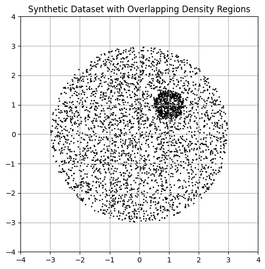

### Task 3 : 

### KDE vs GMM

  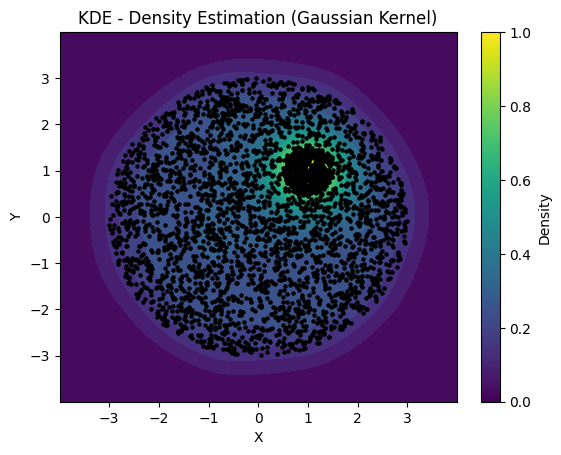
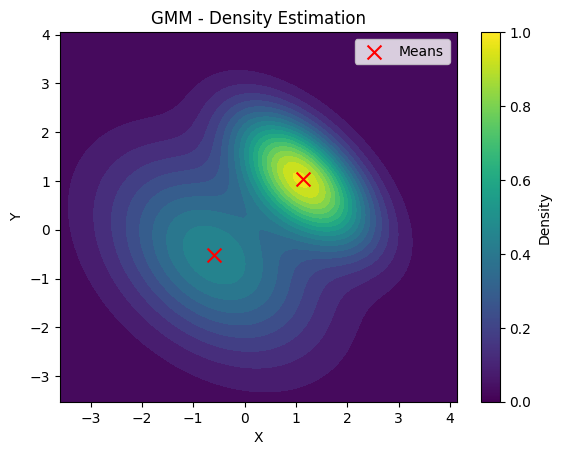
  <!-- 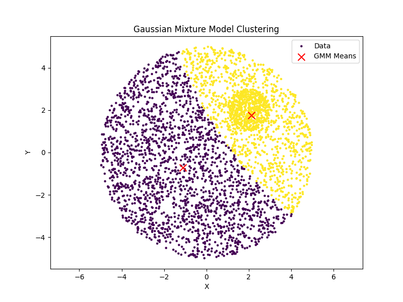 -->

**GMM (Gaussian Mixture Model):**

- For two components, GMM likely separates the clusters because it detects a higher concentration of points around (1.5, 1) and (0.5,0.5) in comparison to the surrounding area

**KDE (Kernel Density Estimation):**

- KDE is a non-parametric method that estimates density by placing kernels at each data point
- The intersecting layers occur because KDE simply reflects the continuous variation in point density
- KDE shows the gradual transitions in density
- The multiple layers you see are contours of equal density, similar to a topographic map

**What happens to GMM as components increase?**

- **Overfitting:**
    - The model divides the data into smaller, less meaningful clusters.

- **Artificial Clusters:**
    - Additional components focus on minor variations, leading to fragmentation.

The model becomes more complex but loses its ability to generalize across datasets.

**Does KDE consistently fit the data?**

Yes, KDE provides a consistent fit because:
It's non-parametric nature means it directly reflects the observed density
The fit is stable across different runs since there are no random initializations
However, the quality of fit depends heavily on:

**Bandwidth Selection:**

- Too Small: Produces noisy estimates with over-detailed density representation.
- Too Large: Causes oversmoothing, losing important structure in the data.

  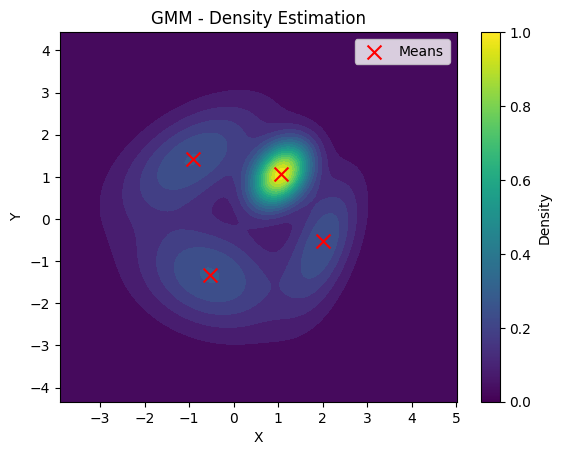

  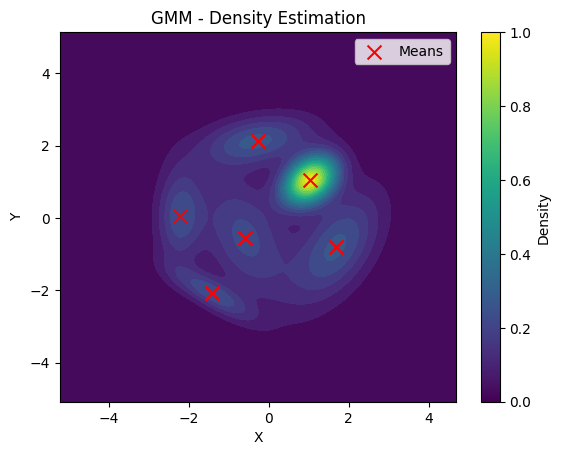

## HMM

### Dataset

***Heatmaps***

- Visualizations of the Mel-Frequency Cepstral Coefficients (MFCCs)
- MFCCs are used in audio analysis, representing the short-term power spectrum of a sound.

X-axis (Time): Represents the time dimension of the audio signal. It shows how the MFCCs change over time as the digit is spoken.

Y-axis (MFCC Coefficients): Represents the different MFCC coefficients calculated. MFCCs capture different aspects of the audio's spectral envelope, kind of like a simplified "fingerprint" of the sound.

Color Intensity: The colors within the heatmap represent the magnitude or strength of each MFCC coefficient at a specific point in time.

Brighter Colors (yellow): Indicate higher values or stronger presence of that particular MFCC coefficient at that time.

Darker Colors (blue, purple): Indicate lower values or weaker presence of that MFCC coefficient.

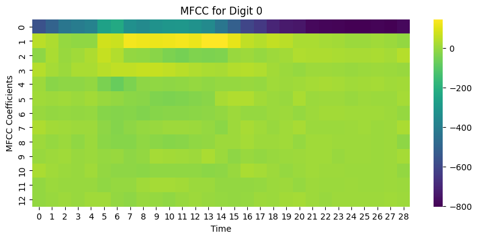 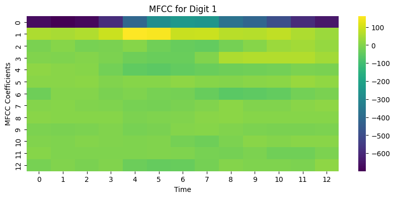 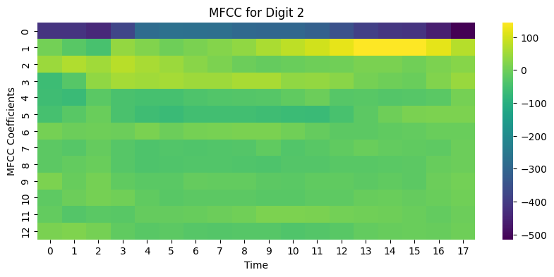 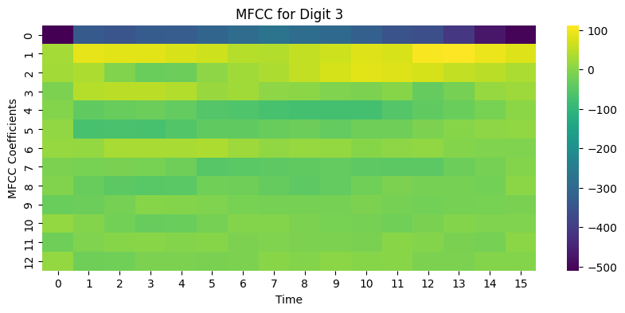 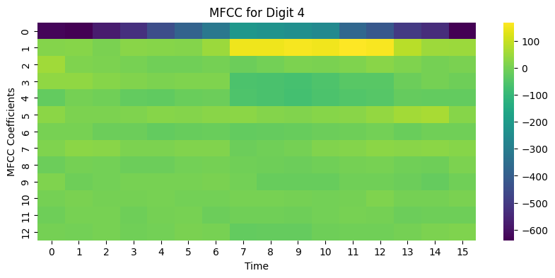 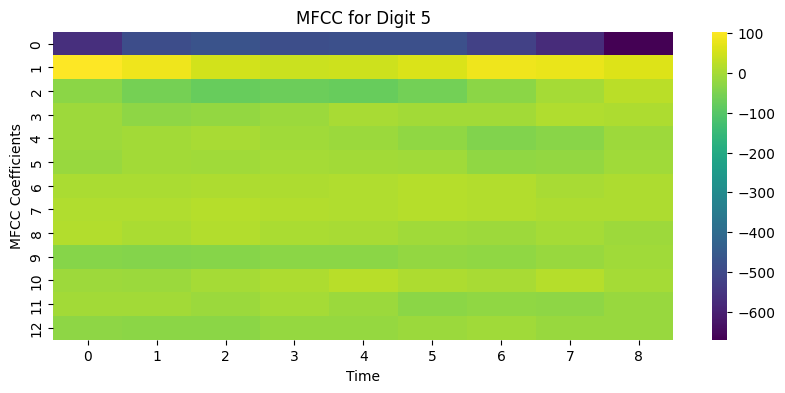 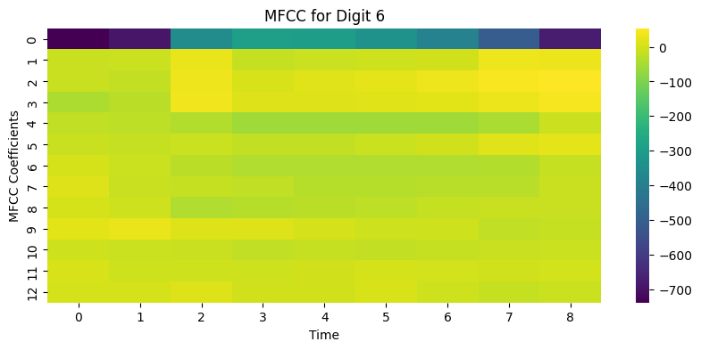 
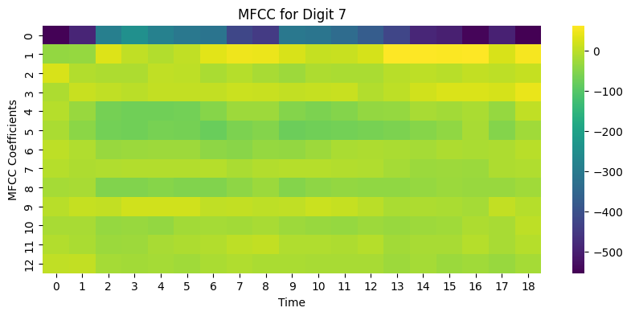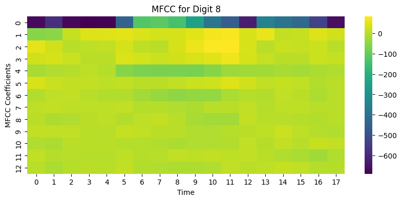 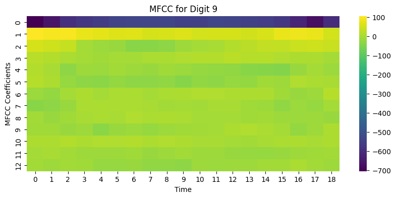

***Observations***
- Silence represented by darker regions.
- Transitions between different sounds as the digit is spoken, reflected as shifts in the  color intensities within the heatmap.

- heatmap for digit "3"

    - Initial silence - darker regions.
    - brighter region corresponding to the "th" sound
    - transition to a different pattern representing the "r" sound.
    - brighter region for the "ee" vowel sound, likely with more energy in lower frequencies.
    - Final silence or fading out of the sound (darker regions).

***Why HMMs are Suitable?***

- **Modeling Temporal Sequences**: HMMs are particularly good at modeling sequential data where the order of observations matters. We can see from the heatmaps that ***MFCC of speech*** is a ***temporal and sequential*** process, where the sequence of sounds is important for recognizing a word or digit.

- **Hidden States and Observations**: 

    - **Hidden States**: These represent the underlying phonetic units (phonemes or parts of phonemes) that make up a spoken digit. 
    - **Observations**: MFCC features extracted from the audio are the observable manifestations of the hidden states.
    - **Example:**    ***Digits with prominent vowel sounds*** (like "zero," "one," "two") might show bright colours in the lower frequency regions of the heatmap, 

- **HMMs Capture the Transitions between hidden states**

### Metrics

- Provided Test Set

        Accuracy: 92.33% 

- Personal Recordings

        Accuracy: 42.86%

## RNN

**Refer RNN_4_1.ipynb and RNN_4_2.ipynb**